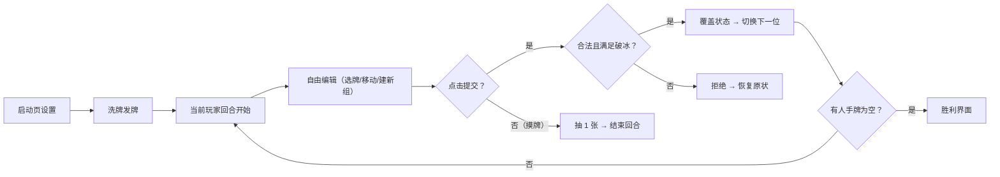

# 拉密 (Rummikub) 网页游戏 — 产品需求文档 (PRD)

## 1. 产品概述
- 一款基于 HTML5/JavaScript 的经典桌游「拉密」在线实现，支持 2–4 人热座对战与 Bot 陪玩，完整覆盖标准规则（含破冰、百搭、重组替换）。
- 面向中文桌游爱好者，目标是提供零部署门槛、体验流畅、视觉精美的浏览器版拉密。

## 2. 核心功能

### 2.1 用户角色
| 角色 | 注册方式 | 核心权限 |
|------|----------|----------|
| 人类玩家 | 无需注册，进入即玩 | 选择手牌、拖拽重组、提交回合、摸牌结束 |
| Bot 玩家 | 系统内置 | 自动计算合法出牌并执行，可选简易/中等策略 |

### 2.2 功能模块
1. **启动页**：玩家数量（2–4）、类型（人类/Bot）与颜色主题选择。
2. **游戏主页面**：桌面牌组区、玩家手牌区、公共牌堆、回合信息、操作按钮、操作日志。
3. **规则校验引擎**：顺组 / 群组判定、百搭适配、破冰 ≥30 点校验、提交前整体合法性回溯。
4. **Bot 对手模块**：在合法框架内挑选出牌组合，若无则摸牌。
5. **游戏结束页**：显示胜者与得分，并提供「再来一局」入口。

### 2.3 页面详情
| 页面名称 | 模块名称 | 功能描述 |
|----------|----------|----------|
| 启动页 | 玩家配置区 | 玩家人数、类型（人/Bot）选择，开始游戏按钮 |
| 游戏主页面 | 桌面区 | 展示所有已提交的牌组，支持点击选择牌、空白区建新组 |
| 游戏主页面 | 手牌区 | 横向展示当前玩家手牌，点击选中/取消，可加入桌面组 |
| 游戏主页面 | 操作条 | 撤销一步 / 提交回合 / 摸牌并结束 / 重置游戏 |
| 游戏主页面 | 日志区 | 最近 10 条操作日志，滚动展示 |
| 结束页 | 结果展示 | 胜者高亮、剩余点数统计、再来一局 |

## 3. 核心流程
玩家进入 → 选择玩家数量与类型 → 发牌 14 张 → 轮到玩家 → 自由编辑桌面/手牌（临时状态）→ 点击「提交」校验合法性 → 合法则覆盖游戏状态、切换玩家；否则提示并保持原状 → 直至某人打出最后一张牌 → 胜利界面。

## 4. 用户界面设计

### 4.1 设计风格
- 主色：深靛蓝 `#1e3a8a`，副色：金黄 `#fbbf24`；牌面使用真实颜色区分（红/黄/蓝/黑），百搭采用彩虹渐变 + 星标。
- 字体：标题用 `Playfair Display` 衬线，正文用 `Inter`，数字用 `JetBrains Mono`，营造精致桌游感。
- 圆角卡片 + 柔和阴影 + 细微颗粒纹理背景，营造"桌上游戏"质感。
- 动效：选中缩放 1.06、提交成功淡入、非法操作红色闪烁 + 轻微震动。

### 4.2 页面设计概览
| 页面名称 | 模块 | 布局 / 颜色 / 字体 / 动效 |
|----------|------|---------------------------|
| 启动页 | 配置区 | 居中竖排卡片，靛蓝背景 + 金黄按钮，入场淡入+平移 |
| 游戏主页面 | 桌面区 | 横向排列的牌组卡，白底浅色边框，可横向滚动 |
| 游戏主页面 | 手牌区 | 底部固定横条，牌面紧凑；选中高亮金黄边 |
| 游戏主页面 | 操作条 | 顶部按钮栏：撤销 / 提交 / 摸牌 / 重置；不同语义使用不同颜色 |
| 游戏主页面 | 日志区 | 右侧窄栏，半透明暗色，滚动显示 |
| 结束页 | 结果弹窗 | 大号金黄色胜利标题，列表展示各玩家剩余点数 |

### 4.3 响应式
- 桌面优先：最小宽度 1024px，1440px 及以上自动扩展内容宽度。
- 移动端：允许滚动，牌面紧凑，按钮最小 44px 点击面积。

### 4.4 3D 场景指引
- 不适用；本项目使用 2D DOM + CSS 绘制。
