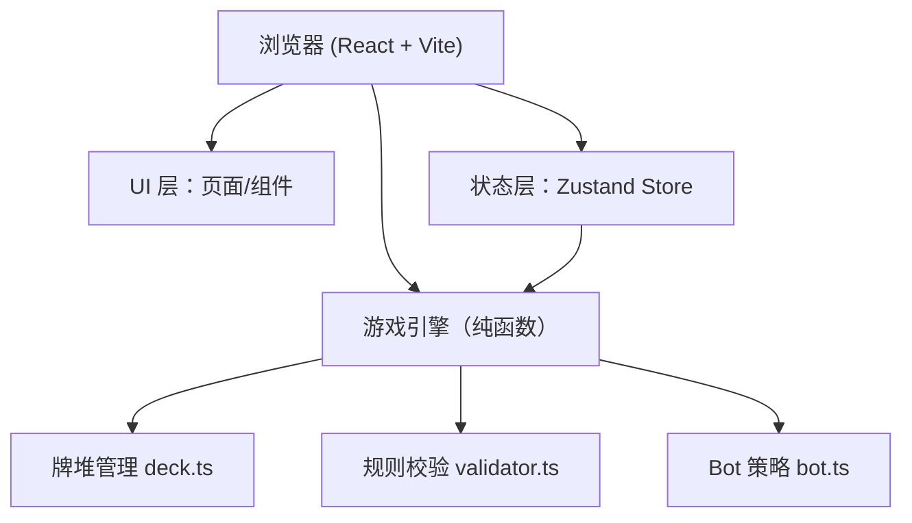

# 拉密 (Rummikub) 网页游戏 — 技术架构文档

## 1. 架构设计


## 2. 技术描述
- 前端：React@18 + TypeScript + Vite@5
- 样式：Tailwind CSS@3（结合自定义 CSS 变量与字体）
- 状态：Zustand，集中管理 `GameState` 与临时编辑态 `TempState`
- 后端：无，纯前端实现；本地存档使用 `localStorage`

## 3. 路由定义
| 路由 | 页面 | 功能 |
|------|------|------|
| `/` | `StartPage.tsx` | 玩家数量与类型配置、开始按钮 |
| `/game` | `GamePage.tsx` | 游戏主界面（桌面/手牌/操作条/日志） |

## 4. 数据模型

### 4.1 核心类型定义

```ts
// src/game/types.ts
type Color = 'red' | 'yellow' | 'blue' | 'black';

interface Card {
  id: string;          // 唯一 id
  color?: Color;       // 普通牌的颜色
  number?: number;     // 普通牌数字 1..13
  isJoker: boolean;    // 是否百搭
}

interface Player {
  id: string;
  name: string;
  isBot: boolean;
  hand: Card[];
  hasBrokenIce: boolean;
}

interface Group {
  id: string;
  cards: Card[];       // 一组牌（顺组或群组）
}

interface GameState {
  players: Player[];
  currentIndex: number;
  deck: Card[];
  table: Group[];
  winner: Player | null;
  logs: string[];      // 最近 10 条
}

// 编辑态：当前回合的临时操作
interface TempState {
  handBeforeTurn: Card[]; // 回合开始时的手牌，用于"新打出的牌"判断
  tableBeforeTurn: Group[];
  snapshotStack: Array<{ hand: Card[]; table: Group[] }>;
}
```

### 4.2 牌面标识
- 每张牌使用 `id` 区分（例如 `r-1-a` 表示红 1 第 1 张、`joker-1` 表示百搭）。
- 百搭不绑定颜色/数字，提交时由校验器自动适配。

## 5. 合法性校验算法 (validator.ts)

- **单组合法性 `isValidGroup(cards)`**：判断是否为顺组或群组（至少 3 张），允许至多 1 张百搭。
- **整体合法性 `validateTable(tableGroups)`**：遍历全部组并逐组校验。
- **破冰校验**：新打出牌（`handBeforeTurn 差集 currentHand`）的点数之和 ≥ 30，百搭点数按其所在组当前"代表数字"计算。
- **回溯 + 剪枝**：当提交时给出的分组被拒绝时，允许用户手动重新拖拽；必要时也提供"自动整理"按钮（使用回溯算法寻找合法分组）。

## 6. 模块划分与组件目录

```
src/
  pages/
    StartPage.tsx        # 启动配置页
    GamePage.tsx         # 游戏主页
  components/
    CardTile.tsx         # 单张牌
    HandBar.tsx          # 手牌区
    TableArea.tsx        # 桌面牌组区
    ControlBar.tsx       # 操作按钮条
    LogPanel.tsx         # 日志侧栏
    WinnerModal.tsx      # 胜利弹窗
  game/
    types.ts
    deck.ts              # 洗牌、发牌
    validator.ts         # 合法性判断
    bot.ts                # Bot 策略
    store.ts             # Zustand store
  App.tsx
  main.tsx
  index.css
```

## 7. 关键交互流程

1. 玩家回合开始 → store 快照 `handBeforeTurn / tableBeforeTurn`。
2. 用户点击手牌选中 → 点击桌面某组/空白 → 推入对应组（或新建组）。
3. 用户点击桌面牌 → 点击另一组/空白 → 在组间移动。
4. `撤销`：弹栈回到上一步；`提交`：调用 `validateTable` 并检查破冰；合法则覆盖并切换玩家。
5. `摸牌并结束`：从 deck 抽 1 加入手牌，立即结束本回合。
6. Bot 回合：调用 `bot.ts` → 寻找一个合法出牌方案（或摸牌）→ 直接提交。

## 8. 字体与主题

- 在 `index.css` 中声明 `Playfair Display / Inter / JetBrains Mono`（Google Fonts），使用 CSS 变量定义主色。
- 牌面背景色与边框根据 `color` 渲染；百搭使用线性渐变 + 星标。

## 9. 性能与可扩展性

- 牌总数 ≤ 106，校验器采用简单回溯即可满足交互延迟要求。
- 状态变化通过 Zustand 集中管理，便于未来扩展网络对战（加入 WebSocket 层即可）。
- 可插拔 Bot 策略：`easy` / `medium` 两档，通过参数切换。
